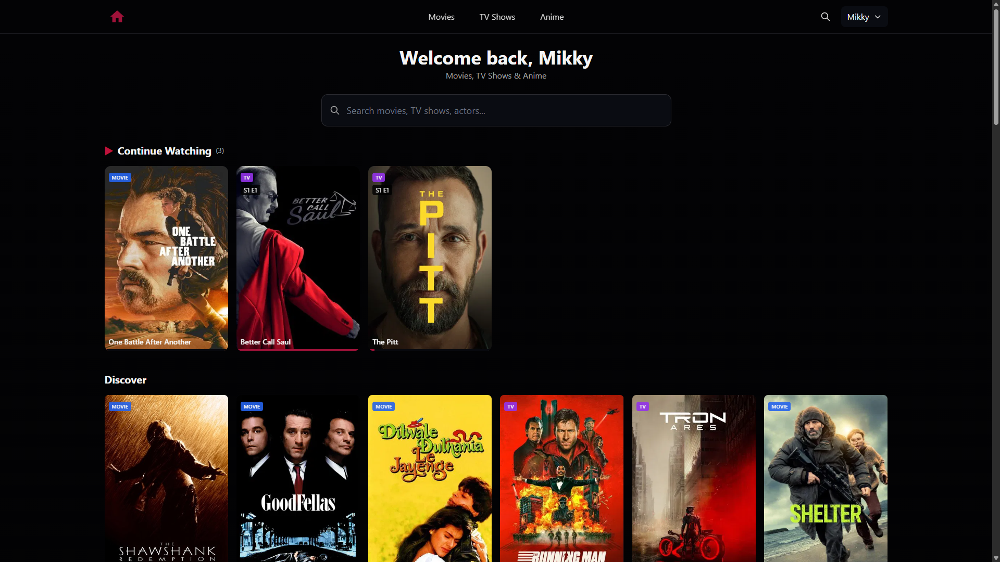
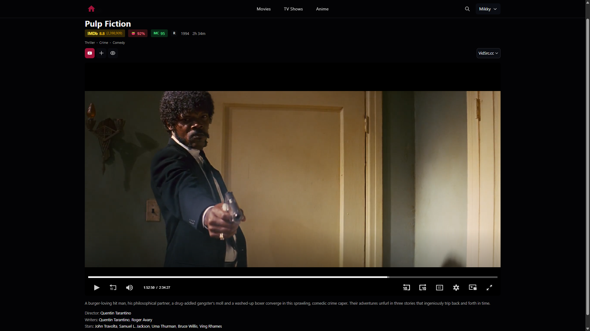
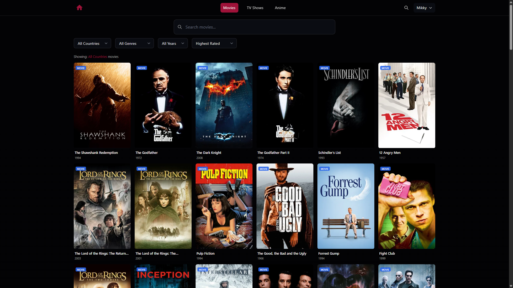

# EZstream


A modern, high-performance streaming platform built with Next.js 14, featuring movies, TV shows, and anime with a sleek dark-themed UI.


## Features

### Core Features
- **User Authentication** - Secure login with JWT sessions and bcrypt password hashing
- **Watch History** - Continue watching from where you left off
- **Watchlist** - Save movies and shows to watch later
- **Multi-Source Streaming** - 10 streaming providers with automatic fallback
- **Smart Source Selection** - Optimized source order for movies, TV, and anime

### Discovery & Browsing
- **Real-time Search** - Instant search with live results as you type
- **Advanced Filtering** - Filter by genre, language/country, year, and sort options
- **IMDB Ratings** - Accurate IMDB ratings via OMDb API with smart sorting
- **Top Rated Lists** - IMDB-ranked top 100 for movies and TV (fetches multiple pages, sorts by IMDB)
- **Infinite Scroll** - Seamless content discovery with lazy loading

### Content Details
- **YouTube Trailers** - Watch trailers before deciding to watch
- **Rich Metadata** - IMDB, Rotten Tomatoes, and Metacritic scores
- **Director/Writer Pages** - Click on any crew member to see their full filmography
- **Cast Pages** - View actor filmographies with both acting and directing credits
- **Content Tags** - TMDB keywords displayed as tags for better discovery

### User Experience
- **Responsive Design** - Optimized for all screen sizes (mobile, tablet, desktop)
- **Dark Theme** - Easy on the eyes with a modern dark UI
- **Performance Optimized** - Fast image loading, API caching, and minimal bundle size

## Screenshots


***
***

***
***

***
***
## Tech Stack

| Category | Technology |
|----------|------------|
| Framework | Next.js 14 (App Router) |
| Language | TypeScript |
| Styling | Tailwind CSS |
| Database | SQLite with better-sqlite3 (WAL mode) |
| Auth | JWT (jose) + bcryptjs |
| Metadata API | TMDB (movies, TV, people, trailers) |
| Ratings API | OMDb (IMDB ratings, Rotten Tomatoes, Metacritic) |
| Deployment | PM2 + Nginx + Cloudflare |

## Project Structure

```
ezstream/
├── app/
│   ├── api/                 # API routes
│   │   ├── auth/            # Authentication endpoints
│   │   ├── browse/          # Content discovery
│   │   ├── movie/           # Movie details + trailers
│   │   ├── tv/              # TV show details + trailers
│   │   ├── person/          # Actor/Director filmography
│   │   ├── search/          # Search functionality
│   │   └── user/            # User data (history, watchlist)
│   ├── browse/              # Browse pages
│   │   ├── anime/           # Anime section
│   │   ├── movies/          # Movies section
│   │   └── tv/              # TV shows section
│   ├── components/          # Reusable components
│   ├── contexts/            # React contexts
│   ├── hooks/               # Custom hooks
│   └── watch/               # Video player page
├── lib/                     # Utility libraries
│   ├── auth.ts              # Authentication helpers
│   ├── db.ts                # Database setup & queries
│   ├── omdb.ts              # OMDb API client (IMDB ratings)
│   ├── tmdb.ts              # TMDB API client (metadata, trailers)
│   └── vidsrc.ts            # Streaming sources
├── types/                   # TypeScript definitions
└── public/                  # Static assets
```

## Getting Started

### Prerequisites

- Node.js 18+
- npm or yarn
- TMDB API key ([Get one free](https://www.themoviedb.org/settings/api))
- OMDb API key ([Get one free](https://www.omdbapi.com/apikey.aspx)) - for IMDB ratings

### Installation

1. **Clone the repository**
   ```bash
   git clone https://github.com/yourusername/ezstream.git
   cd ezstream
   ```

2. **Install dependencies**
   ```bash
   npm install
   ```

3. **Configure environment**
   ```bash
   cp .env.example .env.local
   ```
   
   Edit `.env.local` and add your API keys and session secret:
   ```env
   TMDB_API_KEY=your_tmdb_api_key_here
   OMDB_API_KEY=your_omdb_api_key_here
   SESSION_SECRET=your_random_secret_here
   ```
   
   Generate a secure session secret:
   ```bash
   openssl rand -base64 32
   ```

4. **Seed the database** (optional - creates demo users)
   
   First, copy the example seed file and add your users:
   ```bash
   cp scripts/seed-users.example.ts scripts/seed-users.ts
   ```
   
   Then edit `scripts/seed-users.ts` and add your users to the array.
   
   Finally, run the seed script:
   ```bash
   npm run seed
   ```

5. **Start the development server**
   ```bash
   npm run dev
   ```

6. **Open** [http://localhost:3000](http://localhost:3000)

## Performance Optimizations

This project implements several performance best practices:

- **Image Loading** - TMDB CDN with optimized sizes, lazy loading, blur placeholders
- **API Caching** - Server-side caching for TMDB (5min browse, 1hr details) and OMDb (24hr ratings)
- **Code Splitting** - Automatic route-based code splitting
- **React Optimizations** - `React.memo`, `useMemo`, `useCallback` for efficient re-renders
- **Database** - SQLite with WAL mode for concurrent read/write access
- **CDN Ready** - Cloudflare integration for edge caching

## Deployment

### Production Build

```bash
npm run build
npm start
```

### PM2 (Recommended)

```bash
pm2 start ecosystem.config.js
```

### With Nginx

See `DEPLOY.md` for detailed Nginx configuration and Cloudflare setup.

## Streaming Sources

The platform supports 10 streaming providers with smart fallback:

| Priority | Source | Notes |
|----------|--------|-------|
| 1 | VidSrc.cc | Primary - fewer ads |
| 2 | VidSrc.me | 87K movies, 19K series, 80% 1080p |
| 3 | VidSrc.to | Mirror |
| 4 | Embed.su | Very reliable |
| 5 | MoviesAPI | Movie-focused |
| 6 | AutoEmbed | Good coverage |
| 7 | VidSrc.pro | Additional option |
| 8 | SuperEmbed | Wide coverage |
| 9 | 2Embed | Backup |
| 10 | StreamSRC | Last resort |

VidSrc.cc is the primary source for all content due to fewer ads and good reliability.

## License

This project is for educational purposes only. All streaming content is provided by third-party services.

## Acknowledgments

- [TMDB](https://www.themoviedb.org/) for the comprehensive movie/TV database and trailers
- [OMDb](https://www.omdbapi.com/) for IMDB ratings, Rotten Tomatoes, and Metacritic scores
- [Next.js](https://nextjs.org/) for the amazing React framework
- [Tailwind CSS](https://tailwindcss.com/) for the utility-first CSS framework


